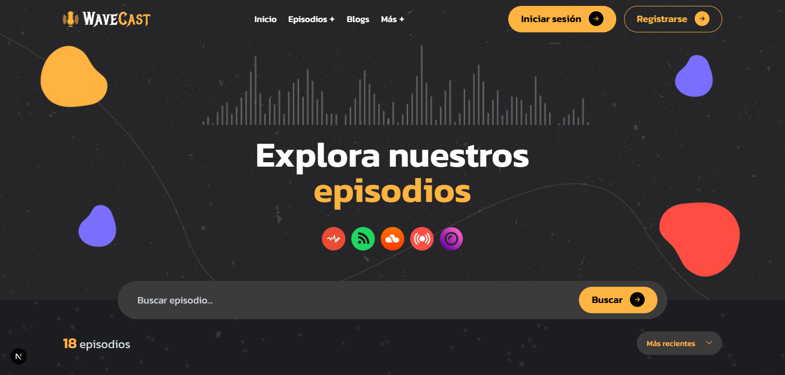
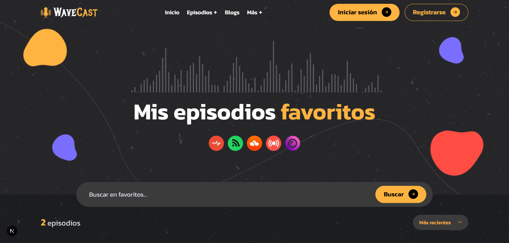
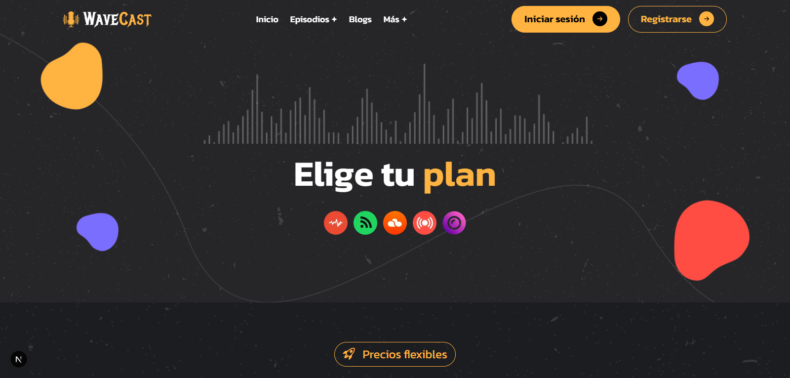

# 🎙️ WaveCast · Tu Podcast, Tu Voz, Tu Historia 🎧

[](https://wave-cast-flax.vercel.app/)

Bienvenido a **WaveCast**, la plataforma moderna de podcasting que conecta creadores de contenido con audiencias apasionadas. Creemos que **cada voz merece ser escuchada, cada historia merece ser contada y cada conversación puede transformar vidas**.

Con un diseño elegante, intuitivo y completamente responsive, **WaveCast** ofrece una experiencia premium tanto para podcasters como para oyentes. 🎵✨

---

## 🌟 Características Principales

- 🎧 **Reproducción de episodios** con interfaz moderna y controles intuitivos
- 🔍 **Búsqueda avanzada** con filtros por host, tema y categoría
- ❤️ **Sistema de favoritos** con persistencia en localStorage
- 📱 **Totalmente responsive**, optimizado para todos los dispositivos
- 🎨 **Diseño moderno** con animaciones suaves y transiciones fluidas
- 📝 **Blog integrado** con artículos sobre podcasting y storytelling
- 💰 **Planes flexibles** con comparativa de características
- 🎯 **FAQ interactiva** con acordeones animados para resolver dudas

---

## ❓ ¿Por qué WaveCast?

El nombre **WaveCast** representa nuestra esencia:

- **Wave** = Ondas sonoras - La tecnología que da vida a las voces
- **Cast** = Transmitir - Compartir historias que inspiran y transforman

Nuestro objetivo es **democratizar el acceso al podcasting** con una plataforma que combine calidad de audio, diseño excepcional y herramientas poderosas para creadores y oyentes.

---

## 🛠️ Tecnologías Utilizadas 👨‍💻

| HTML | CSS | JavaScript | React | TypeScript | Tailwind CSS | Next.js | Node.js |
|------|-----|------------|--------|-------------|---------------|---------|---------|
|  |  |  |  |  |  |  |  |

**Librerías adicionales:**
- 🔥 **React Hot Toast** - Notificaciones elegantes y personalizables
- 🎬 **React CountUp** - Contadores animados para estadísticas
- 🎨 **Bootstrap Icons** - Iconografía completa y moderna
- 🖼️ **Next/Image** - Optimización automática de imágenes

---

## 📂 Estructura del Proyecto
```
wavecast/
├── app/                   # App Router de Next.js
│   ├── about/             # Página sobre nosotros
│   ├── blog/              # Blog y artículos
│   ├── contact/           # Formulario de contacto
│   ├── episode/           # Episodios del podcast
│   ├── faq/               # Preguntas frecuentes
│   ├── host-profile/      # Perfiles de hosts
│   ├── index/             # Página principal (Home)
│   └── pricing/           # Planes y precios
├── components/            # Componentes reutilizables
│   ├── BannerEpisode/
│   ├── Button/
│   ├── ClientWrapper/
│   ├── EmptyState/
│   ├── EpisodeBadge/
│   ├── EpisodeCard/
│   ├── Footer/
│   ├── HostCard/
│   ├── IconFeature/
│   ├── Navbar/
│   ├── PageSection/
│   ├── PricingCard/
│   ├── SearchAndFilter/
│   ├── SectionHeader/
│   ├── SectionTitle/
│   ├── SocialIcons/
│   ├── StatCard/
│   └── ... (más componentes)
├── constants/             # Tipos y datos estáticos
│   └── constant.ts
├── data/                  # Datos JSON
│   ├── blogsData.json
│   └── episodesData.json
└── public/               # Recursos estáticos
```

---

## 🚀 Instalación y Uso Local

Sigue estos pasos para clonar y ejecutar el proyecto en tu máquina:

1. **Clona el repositorio:**
```bash
git clone https://github.com/carlossilvadev10/wave-cast.git
```

2. **Entra en el directorio del proyecto:**
```bash
cd wave-cast
```

3. **Instala las dependencias:**
```bash
npm install
```

4. **Ejecuta la aplicación en desarrollo:**
```bash
npm run dev
```

5. **Abre tu navegador en:**
```bash
http://localhost:3000
```

---

## 📦 Scripts Disponibles
```bash
npm run dev          # Inicia el servidor de desarrollo
npm run build        # Genera build de producción
npm run start        # Ejecuta la aplicación en producción
npm run lint         # Ejecuta el linter de código
```

---

## 🎯 Funcionalidades Clave

### Para Oyentes:
- ✅ Explorar episodios por categorías y hosts
- ✅ Guardar episodios favoritos con persistencia local
- ✅ Buscar contenido por título, host o tema
- ✅ Ordenar episodios por fecha, título o popularidad
- ✅ Leer transcripciones completas de episodios
- ✅ Responder quiz interactivos sobre cada episodio

### Para Creadores:
- ✅ Planes flexibles (Gratuito, Premium, Especial)
- ✅ Publicación ilimitada de episodios
- ✅ Analytics de reproducción y engagement
- ✅ Herramientas de monetización
- ✅ Blog para compartir conocimientos
- ✅ Formulario de contacto para colaboraciones

---

## 🎨 Características de Diseño

- **Responsive Design**: Adaptado a móviles, tablets y escritorio
- **Dark Theme**: Diseño oscuro profesional y moderno
- **Animaciones Suaves**: Transiciones y estados hover refinados
- **Accesibilidad**: Semántica HTML5 y ARIA labels
- **Performance**: Componentes optimizados y lazy loading
- **SEO Ready**: Meta tags y structured data

---

## 🌐 Deploy en Vercel

Este proyecto está optimizado para Vercel:

[](https://wave-cast-flax.vercel.app/)

1. Conecta tu repositorio con Vercel
2. Deploy automático en cada push
3. Preview deployments para PRs

---

## 📸 Capturas de Pantalla

### Hero Section


### Explorar Episodios


### Sistema de Favoritos


### Planes de Precios


---

## 🎙️ Secciones Principales

### 🏠 Home
- Hero con llamado a la acción
- Episodios destacados
- Catálogo completo de hosts
- Testimonios de oyentes

### 🎧 Episodios
- Catálogo completo con búsqueda
- Filtros y ordenamiento
- Sistema de favoritos
- Detalles con transcripciones y quiz

### 📝 Blog
- Artículos sobre podcasting
- Consejos para creadores
- Historias de la comunidad
- Guías técnicas

### 💰 Pricing
- 3 planes (Gratuito, Premium, Especial)
- Comparativa de características
- Toggle mensual/anual con descuento
- FAQ específica de planes

### 👥 Hosts
- Perfiles de presentadores
- Búsqueda por nombre o rol
- Información de contacto

### 📞 Contacto
- Formulario de contacto
- Métodos alternativos (email, redes)
- Datos de contacto y ubicación

---

## 🤝 Contribuciones

¡Las contribuciones son bienvenidas! Para contribuir:

1. Haz fork del proyecto
2. Crea una rama (`git checkout -b feature/NuevaCaracteristica`)
3. Commit tus cambios (`git commit -m 'Agregar nueva característica'`)
4. Push a la rama (`git push origin feature/NuevaCaracteristica`)
5. Abre un Pull Request

---

## 📄 Licencia

Este proyecto está bajo la Licencia MIT. Ver [LICENSE](LICENSE) para más detalles.

---

## 📩 Contacto

¿Preguntas o sugerencias? Encuéntrame en:

- 🌐 [Mi GitHub](https://github.com/carlossilvadev10)
- 📧 Email: [carlos.esilva1007@gmail.com](mailto:carlos.esilva1007@gmail.com)
- 💼 [Mi LinkedIn](https://www.linkedin.com/in/carlos-eduardo-silva-bustamante-b6084528b)

---

## 🙏 Agradecimientos

- **Next.js Team** - Por el framework excepcional
- **Vercel** - Por el hosting y deployment
- **Tailwind Labs** - Por Tailwind CSS
- **Comunidad Open Source** - Por las librerías utilizadas

---

💡 **WaveCast** es más que un podcast: Es una **comunidad de voces auténticas** que comparten historias, conocimientos y experiencias que transforman vidas.

🎙️ **¡Tu voz merece ser escuchada!** ✨

---

**Hecho con ❤️ y mucho ☕ por [Tu Nombre]**

⭐ Si te gustó el proyecto, ¡dale una estrella en GitHub!